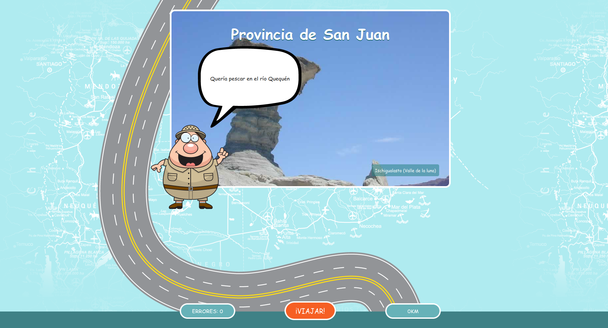

# ¿Dónde está Pancracio el Zorro?

Juego educativo sobre las provincias argentinas.

Disponible para jugar en
[https://juansemarquez.com/pancracio](https://juansemarquez.com/pancracio)

La idea de este juego no es que cada estudiante conozca todas las pistas, sino
que pueda jugarlo con el buscador en otra pestaña.

## Área para docentes

El juego tiene un "área docente". Allí, cada docente puede crearse una cuenta,
y con ella generar sus propias pistas.

Es importante tener en cuenta que las pistas deberían tener como respuesta
una y solo una provincia. Por ejemplo, _¿Dónde se cosecha trigo?_ sería una
mala pista, ya que muchas provincias pueden ser la respuesta correcta.

Una vez que las pistas estén terminadas, el programa otorgará un código
numérico. Para jugar con ese conjunto de pistas, basta con ingresar ese código
al comienzo del juego.

## Autores

[Juanse](https://twitter.com/profejuanse) y [Nacho](https://twitter.com/nacho).

## Quiero colaborar

Hay varias formas de colaborar con este juego:

- Jugando y difundiendo el juego.
- Si detectás errores o tenés alguna sugerencia, podés comunicarte con nosotros.
- Si querés colaborar escribiendo código, tenemos [varios _issues_
abiertos](https://github.com/juansemarquez/zorropancracio/issues), y se
aceptan PR :)

## Licencia

Este juego tiene licencia GPL, puede alojarse en un servidor local en cada
escuela.

